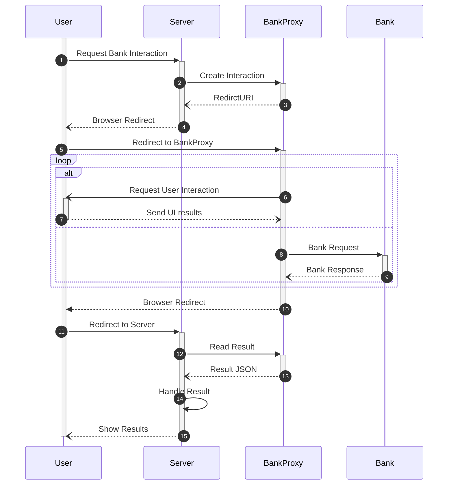
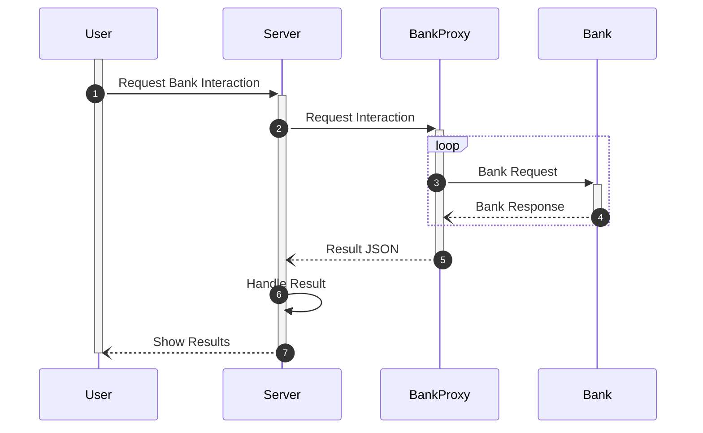

# Introduction

BankProxy is a service, which helps with the interaction with the interfaces of banks. It supports the retrieval of transactions and initiation of payments. The interface is based on the [_NextGenPSD2_](https://www.berlin-group.org/psd2-access-to-bank-accounts) standard of the [_Berlin Group_](https://www.berlin-group.org/) for maximum interoperability.

The service is meant to be deployed beside other services which need access to bank accounts. It provides a unified interface and provides an additional layer of security for handling sensitive login credentials.

BankProxy can call standardized REST API endpoints, parse the HTTP responses of the online banking interface or control a whole browser instance, to interact with the bank. Which behavior will be used, depends on the selected _connector_, which must be configured for every account upfront.

## Control flow

The following diagram shows how the different actors interact. _User_ is usually an end-user with a browser, who wants to trigger an interaction with a bank. This could be the retrieval of the latest transaction from a bank account or the initiation of a payment to e.g. pay an invoice. _Server_ is a server component or application implementing the business logic, which benefits from access to a bank account. A server, which keeps track of invoices, could use the transaction history of a bank account to e.g. mark invoices as paid.

**(1)**: _User_ commands _Server_ to start a new interaction with the bank.

**(2)**: _Server_ creates a new interaction with a _callback URI_ at _BankProxy_.

**(3)**: _BankProxy_ returns a _URI_, to redirect the _User_ to.

**(4)**: _Server_ redirects the _User_ to the _URI_ return from _BankProxy_.

**(5)**: _User_ opens the _URI_ on _BankProxy_.

**(6-9)**: These steps depend on the used bank. In a typical flow the _User_ will be asked for a login name and to confirm a one-time token, while the _BankProxy_ interacts with the _Bank_.

**(10)**: If all previous steps were successful _BankProxy_ redirects the _User_ back to the _callbak URI_ of the _Server_.

**(11)**: _User_ opens the _callback URI_ on the _Server_.

**(12)**: _Server_ loads the result from _BankProxy_ via an identifier passed in the _URI_.

**(13)**: _BankProxy_ sends the result to _Server_ and deletes it.

**(14)**: _Server_ handles the received result by e.g. importing it into a database.

**(15)**: _Server_ informs _User_ about the successful interaction.

## Headless Control Flow

BankProxy supports an additional way to interact with the bank, to allow automatic retrieval of transactions without user interaction. This mode is not supported for all banks, since users can not e.g. confirm a two-factor login this way.

**(1)**: _User_ commands _Server_ to start a new interaction with the bank. This could happen via a scheduled task or cron job for automatic processing.

**(2)**: _Server_ commands _BankProxy_ to interact with the bank.

**(3-4)**: _BankProxy_ interacts with the bank.

**(5)**: _BankProxy_ sends the result to _Server_.

**(6)**: _Server_ handles the received result by e.g. importing it into a database.

**(7)**: _Server_ informs _User_ about the successful interaction.
